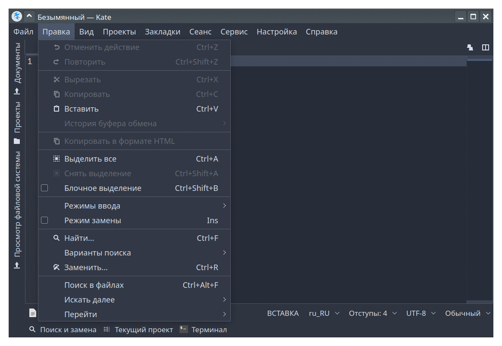

# KS Nord theme for [Kate](https://kate-editor.org/)

</img>

#### Note:
> On screenshot Kate with theme KS Nord(this repo) and application color scheme: [Nordic KDE(Nordic-Darker)](https://store.kde.org/p/1326271) see [GitHub repo](https://github.com/EliverLara/Nordic)

## Intstall

 - In Kate's settings, go to Fonts and Colors and click "Import" to import the schema.
