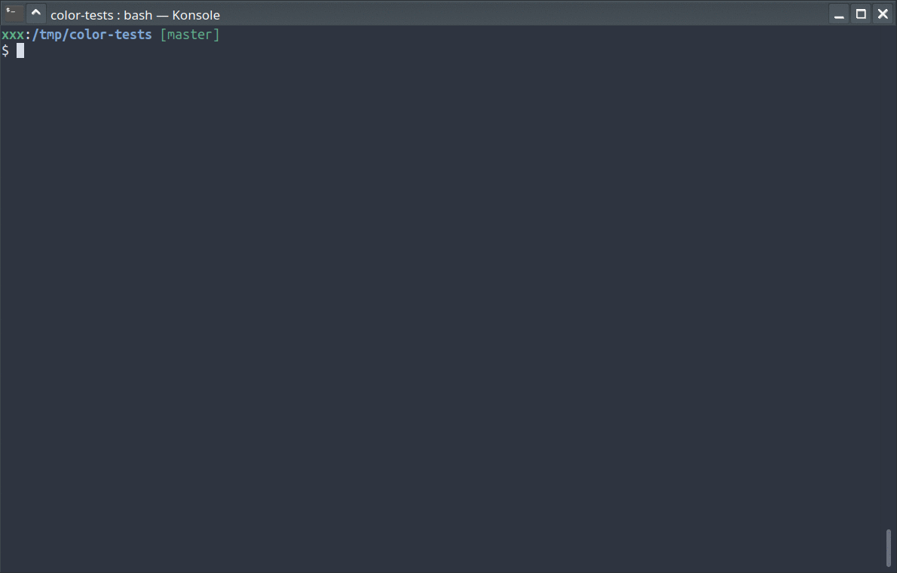

# KS Nord theme for [Konsole](https://konsole.kde.org/)

</img>

## Intstall

 - Copy a theme file to: `~/.local/share/konsole/`
 - Choose a theme in the settings (go to `Konsole`->`Settings`->`Edit Current Profile…`->`Appearance tab`)
