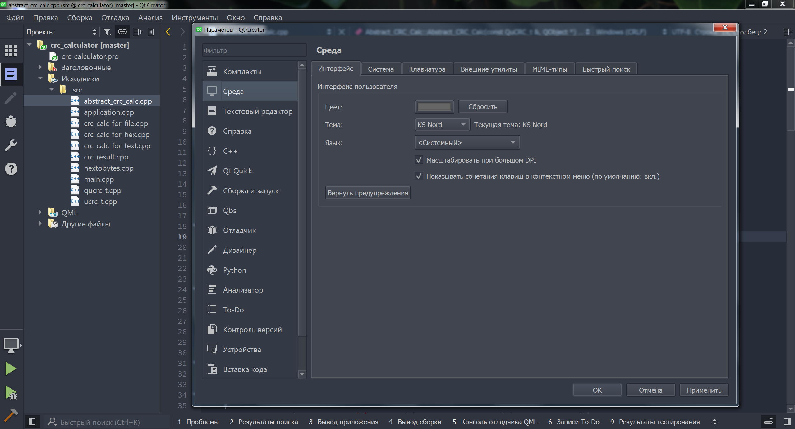
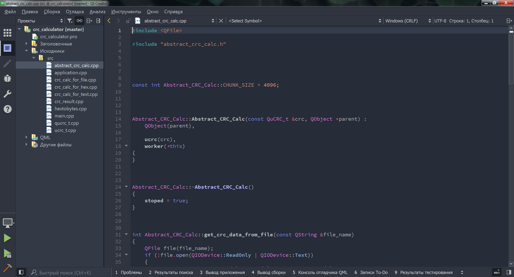
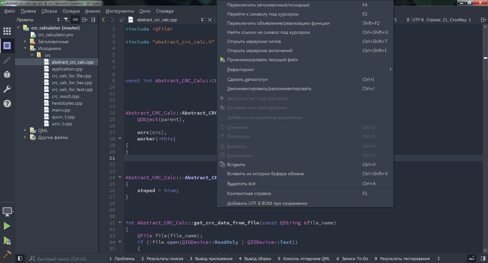

# KS Nord theme for [Qt Creator](https://www.qt.io/product/development-tools)

</img>
</img>
</img>

## Intstall

The theme consists of two parts:

 1. The text editor color-styles (`*.xml`)
 2. The application color-theme (`*.creatortheme`)

 - Move the `*.creatortheme` file to `qtcreator_dir/share/qtcreator/themes/`
 - Move the `*.xml` file to `qtcreator_dir/share/qtcreator/styles/`
 - Go to `Qt Creator`->`Preferences...`, and select the Color theme

## Version

 - `*` - for QtCreator ver-5+
 - `*_15+` - for QtCreator ver-15+
 